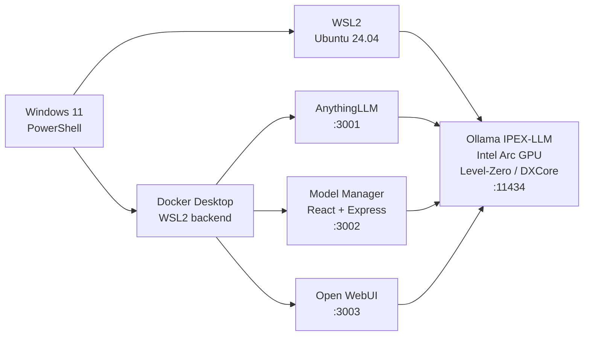

<div align="center">

<h1>LIA</h1>

<p><strong>Local Intelligence Assistant for Intel Arc on Windows</strong></p>

<p>
  Déploie une stack IA locale complète sur Windows avec <strong>Ollama IPEX-LLM</strong>, <strong>AnythingLLM</strong>, <strong>Open WebUI</strong> et un <strong>Model Manager</strong> dédié,<br>
  le tout accéléré par <strong>GPU Intel Arc</strong> via <strong>WSL2 Ubuntu</strong>.
</p>

<p>
  
  
  
  
  
</p>

<p>
  <a href="#quick-start"></a>
  <a href="#architecture"></a>
  <a href="#included-services"></a>
</p>

</div>

<table>
  <tr>
    <td width="50%" valign="top">
      <h3>One command bootstrap</h3>
      <p>Un seul script PowerShell installe WSL2, prépare Ollama IPEX-LLM, configure Docker et démarre les interfaces locales.</p>
    </td>
    <td width="50%" valign="top">
      <h3>Intel Arc focused</h3>
      <p>Le projet cible explicitement une exécution locale optimisée pour Intel Arc avec Level-Zero et DXCore via WSL2.</p>
    </td>
  </tr>
  <tr>
    <td width="50%" valign="top">
      <h3>Multiple frontends</h3>
      <p>AnythingLLM, Open WebUI et une interface Model Manager cohabitent sur la même stack.</p>
    </td>
    <td width="50%" valign="top">
      <h3>Local-first workflow</h3>
      <p>Pull de modèles, import GGUF Hugging Face, chargement VRAM et tests d'inférence sans dépendance cloud.</p>
    </td>
  </tr>
</table>

---

## Table of Contents

- [Overview](#overview)
- [Why LIA](#why-lia)
- [Quick Start](#quick-start)
- [Included Services](#included-services)
- [Architecture](#architecture)
- [Feature Highlights](#feature-highlights)
- [Usage Flow](#usage-flow)
- [Recommended Models](#recommended-models)
- [Project Structure](#project-structure)
- [Technical Notes](#technical-notes)
- [Useful Commands](#useful-commands)
- [Screenshots](#screenshots)
- [Troubleshooting](#troubleshooting)

---

## Overview

LIA est un projet d'intégration local-first conçu pour transformer une machine Windows équipée d'un GPU Intel Arc en station IA locale utilisable immédiatement. Le dépôt relie Windows, WSL2, Ollama IPEX-LLM et Docker dans une architecture cohérente, avec une attention particulière portée à l'expérience d'installation et à la fiabilité du démarrage.

Le projet assemble cinq briques principales :

- Ollama IPEX-LLM dans WSL2 Ubuntu-24.04 pour l'inférence GPU.
- AnythingLLM pour le chat et les usages documentaires.
- Open WebUI comme interface alternative connectée à Ollama.
- Un Model Manager React + Express pour piloter les modèles.
- Un script d'orchestration PowerShell pour déployer toute la stack.

---

## Why LIA

Le besoin de départ est simple : faire fonctionner une stack LLM locale propre sur Windows avec un GPU Intel Arc, sans se battre à chaque redémarrage avec WSL2, la connectivité Docker, les variables d'environnement ou la configuration d'AnythingLLM.

LIA encapsule cette complexité dans un projet unique afin de fournir :

- un bootstrap reproductible ;
- une configuration réseau WSL2 cohérente ;
- une exécution Ollama IPEX-LLM adaptée au matériel Intel Arc ;
- plusieurs interfaces locales prêtes à l'emploi ;
- une gestion de modèles plus simple que la ligne de commande seule.

---

## Quick Start

```powershell
git clone https://github.com/ton-user/lia.git
cd lia
.\pro-ipex.ps1
```

Si WSL2 n'est pas encore présent sur la machine, le script doit être lancé dans un terminal administrateur afin de laisser l'installation se faire correctement.

Une fois la stack démarrée, les services suivants sont exposés :

- http://localhost:3001
- http://localhost:3002
- http://localhost:3003

Le point d'entrée principal est [pro-ipex.ps1](pro-ipex.ps1).

---

## Included Services

| Service | URL | Rôle |
|---|---|---|
| AnythingLLM | http://localhost:3001 | Interface principale pour le chat et les workflows RAG |
| Model Manager | http://localhost:3002 | Téléchargement, import, chargement et suppression des modèles Ollama |
| Open WebUI | http://localhost:3003 | Interface alternative orientée Ollama |
| Ollama API | http://localhost:11434 | API locale exposée depuis WSL2 |

---

## Architecture



Le flux est volontairement simple : Ollama tourne dans WSL2 pour exploiter correctement le GPU Intel Arc, tandis que les interfaces applicatives tournent dans Docker et consomment l'API Ollama via host.docker.internal.

---

## Feature Highlights

| Fonctionnalité | Détail |
|---|---|
| Bootstrap en une commande | Une exécution de [pro-ipex.ps1](pro-ipex.ps1) prépare l'environnement et démarre la stack |
| Auto-configuration WSL2 | Ajuste la connectivité nécessaire entre Windows, WSL2 et Docker |
| Ollama IPEX-LLM | Installation et démarrage automatiques dans Ubuntu-24.04 |
| Auto-config AnythingLLM | Provider Ollama et modèle par défaut injectés automatiquement |
| Open WebUI inclus | Interface alternative lancée sur un conteneur séparé |
| Model Manager intégré | UI dédiée pour gérer les modèles locaux |
| Import GGUF Hugging Face | Import direct depuis une URL de fichier `.gguf` |
| Détection du modèle existant | Sélection automatique d'un modèle raisonnable quand c'est possible |

---

## Usage Flow

### 1. Démarrer la stack

Exécuter [pro-ipex.ps1](pro-ipex.ps1).

### 2. Télécharger ou importer un modèle

Tu peux utiliser le Model Manager, tirer un modèle Ollama classique, ou importer un fichier GGUF direct depuis Hugging Face.

Exemple :

```powershell
wsl -d Ubuntu-24.04 -- bash -c 'cd ~/ollama-ipex && OLLAMA_HOST=127.0.0.1:11434 ./ollama pull qwen2.5:0.5b'
```

### 3. Tester l'inférence locale

```powershell
wsl -d Ubuntu-24.04 -- bash -c 'cd ~/ollama-ipex && OLLAMA_HOST=127.0.0.1:11434 ./ollama run qwen2.5:0.5b "Say: OK" --nowordwrap'
```

### 4. Basculer entre les interfaces

- AnythingLLM pour le workflow applicatif principal.
- Model Manager pour administrer les modèles.
- Open WebUI pour une interaction plus directe avec Ollama.

---

## Recommended Models

Pour une machine légère orientée réactivité sur Arc 140V, les modèles suivants sont de bons candidats :

- `qwen2.5:0.5b`
- `qwen2.5:1.5b`
- `llama3.2:1b`
- `phi3.5:mini`

Le script préfère automatiquement un modèle raisonnable s'il en détecte plusieurs déjà présents.

---

## Project Structure

```text
.
├── pro-ipex.ps1
├── Dockerfile.anythingllm
├── patch-ollama-client.js
├── README.md
└── model-manager/
    ├── server.js
    ├── package.json
    ├── server-package.json
    └── src/
        ├── App.jsx
        └── App.css
```

---

## Technical Notes

### Orchestration script

Le script [pro-ipex.ps1](pro-ipex.ps1) gère l'installation WSL2, la configuration réseau, le téléchargement d'Ollama IPEX-LLM, le démarrage de l'inférence GPU, le build Docker et l'ouverture automatique des interfaces.

### Docker image

Le fichier [Dockerfile.anythingllm](Dockerfile.anythingllm) construit une image basée sur mintplexlabs/anythingllm:latest, y ajoute le frontend du Model Manager, le bridge Express et le wrapper de démarrage qui fait coexister le tout.

### Model Manager

L'interface [model-manager/src/App.jsx](model-manager/src/App.jsx) permet :

- de lister les modèles disponibles ;
- de charger et décharger les modèles en VRAM ;
- de sélectionner le modèle actif ;
- d'importer un fichier GGUF Hugging Face via URL directe.

Le backend [model-manager/server.js](model-manager/server.js) traduit les appels du frontend vers l'API native d'Ollama.

---

## Useful Commands

```powershell
# Logs Ollama dans WSL2
wsl -d Ubuntu-24.04 -- bash -c 'tail -f ~/ollama-ipex/serve.log'

# Lister les modèles disponibles
wsl -d Ubuntu-24.04 -- bash -c 'cd ~/ollama-ipex && ./ollama list'

# Vérifier les processus Ollama
wsl -d Ubuntu-24.04 -- bash -c 'ps aux | grep ollama | grep -v grep'

# Tester une génération rapide
wsl -d Ubuntu-24.04 -- bash -c 'cd ~/ollama-ipex && OLLAMA_HOST=127.0.0.1:11434 ./ollama run qwen2.5:0.5b "Say: OK" --nowordwrap'

# Logs du conteneur AnythingLLM
docker logs -f anythingllm

# Arrêter toute la stack
docker stop anythingllm open-webui
wsl -d Ubuntu-24.04 -- bash -c 'pkill -f ollama'
```

---

## Screenshots

Pour un rendu GitHub plus premium, ajoute ensuite tes captures dans un dossier assets/ et décommente ce bloc :

```md


```

Si tu veux aller plus loin, tu peux aussi ajouter :

- une capture de la home AnythingLLM ;
- une capture du panneau de téléchargement GGUF ;
- une capture d'Open WebUI connecté à Ollama ;
- une capture du graphe Mermaid rendue dans GitHub.

---

## Troubleshooting

| Problème | Vérification utile |
|---|---|
| Ollama ne répond pas | Vérifier la configuration WSL2, les logs et l'ouverture du port `11434` |
| AnythingLLM ne voit pas les modèles | Vérifier que le conteneur joint bien `host.docker.internal:11434` |
| GPU inactif | Confirmer le chargement via les logs Ollama et le backend Level-Zero |
| Réseau WSL2 ou Docker instable | Redémarrer Docker Desktop puis relancer le script |

---

## Positioning

LIA n'est pas un framework généraliste. C'est un dépôt d'intégration ciblé pour obtenir une stack IA locale propre, reproductible et exploitable sur Windows avec Intel Arc, sans passer du temps à recoller manuellement WSL2, Ollama et Docker.

Si l'objectif est de transformer une machine personnelle en station locale de chat, de test de modèles et d'expérimentation autour d'Ollama, ce dépôt est construit exactement pour ce cas.
