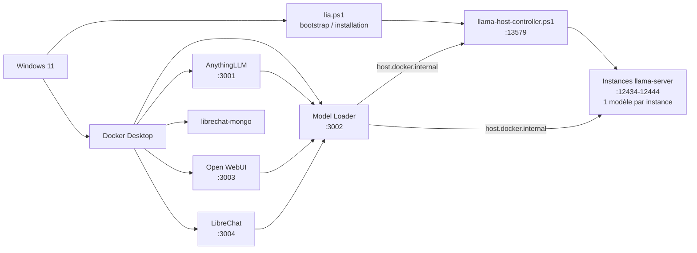

<div align="center">


<h1>LIA-X</h1>

<p><strong>Local Intelligence Assistant pour Windows, Docker et llama.cpp</strong></p>

<p>
  Stack IA locale orientée Windows avec un runtime <strong>llama.cpp</strong>, un contrôleur hôte PowerShell,
  un <strong>Model Loader</strong> GGUF, et les frontends <strong>AnythingLLM</strong>, <strong>Open WebUI</strong> et <strong>LibreChat</strong>.
</p>

<p>
  
  
  
  
  
</p>

</div>

## Table des matières

- [Vue d'ensemble](#vue-densemble)
- [Nouveautés de cette version](#nouveautés-de-cette-version)
- [Services inclus](#services-inclus)
- [Architecture](#architecture)
- [Flux d'utilisation](#flux-dutilisation)
- [Fonctionnalités clés](#fonctionnalités-clés)
- [Structure du projet](#structure-du-projet)
- [Notes techniques](#notes-techniques)
- [Commandes utiles](#commandes-utiles)
- [Dépannage](#dépannage)

## Vue d'ensemble

LIA-X est une stack IA locale pensée pour Windows. La couche applicative s'exécute dans Docker, tandis que le script PowerShell sert de bootstrap pour l'installation des prérequis, la préparation du runtime et la configuration initiale.

Le runtime d'inférence reste piloté sur l'hôte Windows via [llama-host-controller.ps1](llama-host-controller.ps1), et les conteneurs accèdent au service local par `host.docker.internal`. Cette séparation garde une base simple à maintenir tout en permettant plusieurs interfaces web au-dessus du même socle de modèles.

## Nouveautés de cette version

- Plusieurs modèles GGUF peuvent maintenant être chargés en parallèle. Le contrôleur hôte gère plusieurs instances `llama-server`, attribue un port libre dans la plage `12434-12444`, et conserve l'état de chaque instance dans [runtime/host-runtime-state.json](runtime/host-runtime-state.json).
- Le Model Loader expose un proxy OpenAI-compatible stable via l'identifiant `lia-local`, tout en affichant l'état des modèles chargés, les métadonnées GGUF et le modèle actif.
- LibreChat a été ajouté comme frontend supplémentaire, avec une image Docker dédiée, une configuration préintégrée et un backend MongoDB associé.
- Les frontends AnythingLLM, Open WebUI et LibreChat sont désormais déployés comme conteneurs Docker distincts sur un même réseau applicatif.
- Le script [lia.ps1](lia.ps1) sert désormais au bootstrap et à l'installation. Le fonctionnement quotidien passe par Docker et par les services exposés localement.
- Le contrôleur hôte détecte automatiquement le meilleur backend disponible, avec priorité CUDA pour NVIDIA, Vulkan pour AMD/Intel, puis CPU en repli.

## Services inclus

| Service | URL | Rôle |
|---|---|---|
| Model Loader | http://localhost:3002 | UI et API de contrôle des modèles GGUF, import, métadonnées et proxy OpenAI local |
| AnythingLLM | http://localhost:3001 | Interface de chat et de workflow documentaire |
| Open WebUI | http://localhost:3003 | Interface de chat alternative branchée sur `lia-local` |
| LibreChat | http://localhost:3004 | Frontend OpenAI-compatible supplémentaire |
| Host controller | http://127.0.0.1:13579 | Pilotage des instances `llama-server` |
| llama-server | http://127.0.0.1:12434-12444 | Une instance par modèle chargé, selon les ports disponibles |
| LibreChat MongoDB | interne Docker | Stockage de LibreChat |

Le proxy OpenAI du Model Loader publie un modèle stable nommé `lia-local`. Les interfaces Docker ne pointent pas directement vers un modèle brut, elles parlent à ce proxy qui redirige vers l'instance active.

## Architecture



Le point important est le suivant : un seul modèle est servi par instance `llama-server`, mais plusieurs instances peuvent coexister en mémoire en parallèle. Cela permet de garder plusieurs modèles chargés et d'alterner entre eux sans repartir de zéro à chaque fois.

## Flux d'utilisation

1. Lancer [lia.ps1](lia.ps1) pour installer les prérequis, préparer les images et initialiser la stack.
2. Ouvrir Docker Desktop si ce n'est pas déjà fait.
3. Aller sur [Model Loader](http://localhost:3002) pour importer un modèle GGUF depuis Hugging Face ou Ollama Library.
4. Charger un modèle, puis en charger d'autres si besoin. Chaque modèle occupe sa propre instance `llama-server` sur un port libre.
5. Utiliser le proxy `lia-local` depuis AnythingLLM, Open WebUI ou LibreChat.

Exemples de références acceptées dans le Model Loader :

- `https://huggingface.co/.../resolve/main/model.gguf`
- `gemma3n:e4b`
- `https://ollama.com/library/gemma3n:e4b`

## Fonctionnalités clés

- Le Model Loader liste les modèles locaux, affiche leur statut, importe des fichiers GGUF, supprime des modèles et extrait des métadonnées détaillées.
- [model-manager/server.js](model-manager/server.js) expose les routes `/health`, `/api/version`, `/api/models/available`, `/api/models/status`, `/api/models/details/:model`, `/api/models/load`, `/api/models/select`, `/api/models/unload` et les routes OpenAI compatibles `/v1/models`, `/v1/chat/completions`, `/v1/completions`, `/v1/embeddings`.
- [model-manager/src/App.jsx](model-manager/src/App.jsx) présente l'état runtime, les modèles en mémoire, les métadonnées GGUF et les raccourcis vers les différents frontends.
- [llama-host-controller.ps1](llama-host-controller.ps1) gère plusieurs instances, persiste l'état, détecte les backends disponibles et surveille les ports actifs pour éviter les doublons.
- [Dockerfile.librechat](Dockerfile.librechat) injecte la configuration LibreChat pour pointer vers `http://model-loader:3002/v1`.
- [Dockerfile.openwebui](Dockerfile.openwebui) configure Open WebUI pour utiliser le même proxy OpenAI local.
- [Dockerfile.anythingllm](Dockerfile.anythingllm) conserve la configuration de démarrage adaptée à la stack LIA-X.
- Le Model Loader conserve un identifiant de proxy stable, `lia-local`, ce qui simplifie la configuration côté frontend.

## Structure du projet

```text
.
├── Dockerfile.anythingllm
├── Dockerfile.librechat
├── Dockerfile.model-loader
├── Dockerfile.openwebui
├── lia.ps1
├── llama-host-controller.ps1
├── librechat.yaml
├── notes.md
├── README.md
├── model-manager/
│   ├── index.html
│   ├── package.json
│   ├── package-lock.json
│   ├── server-package.json
│   ├── server.js
│   ├── public/
│   │   └── logo.svg
│   ├── src/
│   │   ├── App.css
│   │   ├── App.jsx
│   │   └── main.jsx
│   └── vite.config.js
├── models/
└── runtime/
```

## Notes techniques

### Bootstrap et installation

Le script [lia.ps1](lia.ps1) vérifie les prérequis, installe Docker Desktop si nécessaire, prépare le réseau Docker `lia-network`, télécharge ou réutilise les binaires `llama.cpp`, puis construit et lance les conteneurs applicatifs.

### Contrôleur hôte

[llama-host-controller.ps1](llama-host-controller.ps1) est le point de vérité pour l'exécution locale des modèles. Il :

- détecte automatiquement le meilleur backend disponible avec fallback CUDA, Vulkan ou CPU ;
- autorise plusieurs instances `llama-server` en parallèle ;
- assigne un port libre à chaque instance ;
- garde l'état des processus actifs ;
- expose les informations de runtime aux autres services.

### Model Loader

[model-manager/server.js](model-manager/server.js) traduit les actions du frontend vers le contrôleur hôte et vers le runtime local. Il :

- importe des modèles depuis Hugging Face ou Ollama Library ;
- lit les métadonnées GGUF et le contexte détecté ;
- gère le chargement, le déchargement et la sélection des modèles ;
- expose un proxy OpenAI-compatible pour les autres interfaces ;
- applique un circuit breaker côté requêtes vers le contrôleur.

### Frontends Docker

- [Dockerfile.anythingllm](Dockerfile.anythingllm) est utilisé pour construire le conteneur AnythingLLM avec la configuration LIA.
- [Dockerfile.openwebui](Dockerfile.openwebui) configure Open WebUI pour parler au Model Loader local.
- [Dockerfile.librechat](Dockerfile.librechat) et [librechat.yaml](librechat.yaml) définissent l'intégration LibreChat vers le même proxy.

## Commandes utiles

```powershell
# Bootstrap et installation
.\lia.ps1

# Vérifier la santé du Model Loader
Invoke-WebRequest -Uri "http://127.0.0.1:3002/health" -UseBasicParsing

# Vérifier le runtime et les instances actives
Invoke-WebRequest -Uri "http://127.0.0.1:13579/status" -UseBasicParsing

# Vérifier le statut détaillé des modèles
Invoke-WebRequest -Uri "http://127.0.0.1:3002/api/models/status" -UseBasicParsing

# Logs du conteneur Model Loader
docker logs -f model-loader

# Logs du conteneur AnythingLLM
docker logs -f anythingllm

# Logs du conteneur Open WebUI
docker logs -f open-webui

# Logs du conteneur LibreChat
docker logs -f librechat

# Logs de MongoDB pour LibreChat
docker logs -f librechat-mongo
```

## Dépannage

- Si `lia-local` ne retourne rien, vérifier [http://127.0.0.1:13579/status](http://127.0.0.1:13579/status) puis [http://127.0.0.1:3002/api/models/status](http://127.0.0.1:3002/api/models/status).
- Si un modèle ne s'ouvre pas, vérifier qu'un fichier `.gguf` valide est bien présent dans le répertoire modèles et que la plage de ports `12434-12444` n'est pas saturée.
- Si LibreChat ne démarre pas, consulter `docker logs -f librechat` puis `docker logs -f librechat-mongo`.
- Si un frontend Docker ne voit pas le proxy local, vérifier que le conteneur `model-loader` est bien présent sur `lia-network`.
- Si Docker Desktop n'est pas démarré, relancer Docker puis exécuter à nouveau [lia.ps1](lia.ps1).

LIA-X reste un socle local-first pour le chat, l'import de modèles GGUF, les tests multi-modèles et l'expérimentation multi-interfaces sur Windows.