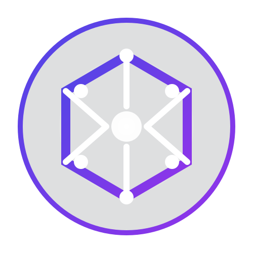

# LIA-X

<div align="center">



<h1>LIA-X</h1>

<p><strong>Local Intelligence Assistant pour Windows, Docker et llama.cpp</strong></p>

<p>
  Stack IA locale Windows avec un contrôleur PowerShell, un Model Loader GGUF,
  et trois frontends Docker : AnythingLLM, Open WebUI et LibreChat.
</p>

<p>
  
  
  
  
  
</p>

</div>

## Table des matières

- [Architecture](#architecture)
- [Diagramme de l'architecture](#diagramme-de-larchitecture)
- [Composants](#composants)
- [Services](#services)
- [Flux de données](#flux-de-données)
- [API](#api)
- [Installation](#installation)
- [Commandes](#commandes)
- [Configuration](#configuration)
- [Dépannage](#dépannage)

## Architecture

LIA-X est une plateforme locale pour tester et déployer des modèles GGUF sur Windows. L'architecture repose sur trois couches principales :

1. **Couche Runtime** : Gestion des instances `llama-server` via un contrôleur PowerShell
2. **Couche Proxy** : Model Loader qui expose une API OpenAI-compatible et sert de proxy
3. **Couche Frontend** : Interfaces utilisateur Dockerisées (AnythingLLM, Open WebUI, LibreChat)

### Diagramme de l'architecture

```
┌─────────────────────────────────────────────────────────────────────────────────┐
│                           LIA-X ARCHITECTURE                                     │
└─────────────────────────────────────────────────────────────────────────────────┘

┌─────────────────────────────────────────────────────────────────────────────────┐
│  LAYER 3: FRONTENDS (Docker Containers)                                         │
│  ┌──────────────┐  ┌──────────────┐  ┌──────────────┐  ┌──────────────┐       │
│  │ AnythingLLM  │  │ Open WebUI   │  │ LibreChat     │  │ Model Loader  │       │
│  │ :3001        │  │ :3003        │  │ :3004         │  │ :3002         │       │
│  │              │  │              │  │               │  │              │       │
│  │ LLM Provider │  │ OpenAI API   │  │ OpenAI API    │  │ Proxy + UI    │       │
│  │ Generic OpenAI│  │ ENABLED      │  │ ENABLED       │  │              │       │
│  └──────────────┘  └──────────────┘  └──────────────┘  └──────────────┘       │
└─────────────────────────────────────────────────────────────────────────────────┘
                                    │
                                    │ HTTP/HTTPS
                                    ▼
┌─────────────────────────────────────────────────────────────────────────────────┐
│  LAYER 2: PROXY & ROUTING (Model Loader)                                        │
│  ┌──────────────────────────────────────────────────────────────────────────┐   │
│  │  Model Loader (Node.js + Express)                                        │   │
│  │  ├─ API Routes: /api/*, /v1/*                                            │   │
│  │  ├─ OpenAI Proxy: /v1/chat/completions, /v1/completions, /v1/embeddings │   │
│  │  ├─ Model Management: /api/models/*                                      │   │
│  │  └─ Health: /health                                                      │   │
│  └──────────────────────────────────────────────────────────────────────────┘   │
│      │                                                                          │
│      │ Proxy OpenAI requests                                                    │
│      ▼                                                                          │
└─────────────────────────────────────────────────────────────────────────────────┘
                                    │
                                    │ Forward to active llama-server
                                    ▼
┌─────────────────────────────────────────────────────────────────────────────────┐
│  LAYER 1: RUNTIME (llama-server instances)                                      │
│  ┌──────────────────────────────────────────────────────────────────────────┐   │
│  │  Controller Host (PowerShell)                                             │   │
│  │  ├─ Port 13579: API de contrôle                                          │   │
│  │  ├─ Gestion des instances llama-server                                   │   │
│  │  ├─ Auto-restart des processus morts                                     │   │
│  │  └─ Relance au démarrage du système                                      │   │
│  └──────────────────────────────────────────────────────────────────────────┘   │
│      │                                                                          │
│      │ Spawns instances                                                         │
│      ▼                                                                          │
│  ┌──────────────────────────────────────────────────────────────────────────┐   │
│  │  llama-server instances (12434-12444)                                    │   │
│  │  ├─ Instance 1: llama3.2-1b.gguf @ :12434                                │   │
│  │  ├─ Instance 2: Qwopus3.5-9B-v3.gguf @ :12435                            │   │
│  │  └─ Max instances: 6 (configuré dans host-runtime-config.json)           │   │
│  └──────────────────────────────────────────────────────────────────────────┘   │
└─────────────────────────────────────────────────────────────────────────────────┘
                                    │
                                    │ llama-server.exe
                                    ▼
┌─────────────────────────────────────────────────────────────────────────────────┐
│  LAYER 0: INFRASTRUCTURE                                                        │
│  ├─ Windows 11                                                                  │
│  ├─ Docker Desktop                                                              │
│  ├─ Network: lia-network                                                        │
│  └─ Storage: models/                                                            │
└─────────────────────────────────────────────────────────────────────────────────┘

┌─────────────────────────────────────────────────────────────────────────────────┐
│  EXTERNAL INTERFACES                                                           │
│  ┌─────────────┐  ┌─────────────┐  ┌─────────────┐  ┌─────────────┐           │
│  │ User Browser│  │ OpenAI API  │  │ CLI Tools   │  │ Other Apps   │           │
│  └─────────────┘  └─────────────┘  └─────────────┘  └─────────────┘           │
└─────────────────────────────────────────────────────────────────────────────────┘
```

## Composants

### Contrôleur Hôte (Controller Host)

Fichier: [`controller/llama-host-controller.ps1`](controller/llama-host-controller.ps1:1)

- **Rôle** : Lance et supervise les instances `llama-server`
- **Fonctionnalités** :
  - Attribution automatique de ports dynamiques (12434-12444)
  - Relance automatique des instances mortes
  - Gestion du cycle de vie (start/stop/restart)
  - Exposition d'API de contrôle sur le port 13579
  - Relance au démarrage Windows (Windows Service)

### Model Loader

Fichiers: [`model-manager/server.js`](model-manager/server.js:1), [`model-manager/src/App.jsx`](model-manager/src/App.jsx:1)

- **Rôle** : Serveur Node.js exposant l'interface utilisateur et le proxy OpenAI
- **Fonctionnalités** :
  - Import et catalogue de modèles GGUF
  - Proxy OpenAI-compatible (`/v1/*`)
  - API de gestion des modèles (`/api/models/*`)
  - Interface React pour la gestion visuelle
  - Circuit breaker pour la résilience

### Frontends Docker

| Frontend | Image Docker | Port | Configuration |
|----------|--------------|------|---------------|
| AnythingLLM | `mintplexlabs/anythingllm:latest` | 3001 | `GENERIC_OPEN_AI_BASE_PATH=http://host.docker.internal:3002/v1` |
| Open WebUI | `ghcr.io/open-webui/open-webui:main` | 3003 | `ENABLE_OPENAI_API=true`, `OPENAI_API_BASE_URL=http://host.docker.internal:3002/v1` |
| LibreChat | `ghcr.io/danny-avila/librechat:latest` | 3004 | `OPENAI_BASE_URL=http://host.docker.internal:3002/v1`, `OPENAI_MODELS=lia-local` |

### Runtime Configuration

Fichier: [`runtime/host-runtime-config.json`](runtime/host-runtime-config.json:1)

```json
{
  "server_port_start": 12434,
  "server_port_end": 12444,
  "max_instances": 6,
  "controller_port": 13579,
  "proxy_model_id": "lia-local",
  "default_gpu_layers": 999,
  "backend": "vulkan",
  "binary_path": "C:\\Users\\evolu\\Documents\\Github-repo\\LIA-X\\runtime\\llama-releases\\...\\llama-server.exe",
  "models_dir": "C:\\Users\\evolu\\Documents\\Github-repo\\LIA-X\\models"
}
```

## Services

| Service | URL | Rôle |
|---------|-----|------|
| Model Loader | http://localhost:3002 | Import GGUF, métadonnées, catalogue, proxy OpenAI |
| AnythingLLM | http://localhost:3001 | Interface de chat principale |
| Open WebUI | http://localhost:3003 | Interface de chat alternative |
| LibreChat | http://localhost:3004 | Frontend OpenAI-compatible |
| Contrôleur hôte | http://127.0.0.1:13579 | Contrôle des processus `llama-server` |
| `llama-server` | http://127.0.0.1:12434-12444 | Instance par modèle sur ports dynamiques |

## Flux de données

### Flux d'inférence (Request Flow)

```
User Request
    │
    ▼
┌─────────────────────────────────────┐
│  Frontend (AnythingLLM/Open WebUI)  │
│  - Formule la requête               │
│  - Envoie vers /v1/chat/completions │
└─────────────────────────────────────┘
    │
    ▼
┌─────────────────────────────────────┐
│  Model Loader (Proxy Layer)         │
│  - Receit la requête HTTP           │
│  - Valide le modèle actif            │
│  - Construit l'URL du llama-server  │
│  - Ajoute headers appropriés        │
└─────────────────────────────────────┘
    │
    ▼
┌─────────────────────────────────────┐
│  Controller Host                    │
│  - Récupère l'instance active       │
│  - Vérifie la santé                 │
└─────────────────────────────────────┘
    │
    ▼
┌─────────────────────────────────────┐
│  llama-server                       │
│  - Récupère le contexte             │
│  - Génère la réponse               │
│  - Retourne le JSON                │
└─────────────────────────────────────┘
    │
    ▼
┌─────────────────────────────────────┐
│  Model Loader                       │
│  - Formate la réponse               │
│  - Ajoute metadata                  │
└─────────────────────────────────────┘
    │
    ▼
┌─────────────────────────────────────┐
│  Frontend                           │
│  - Affiche la réponse               │
└─────────────────────────────────────┘
```

### Flux de chargement de modèle

```
User Action (Import GGUF)
    │
    ▼
┌─────────────────────────────────────┐
│  Model Loader UI                    │
│  - Sélectionne le fichier .gguf     │
│  - Lit les métadonnées GGUF         │
└─────────────────────────────────────┘
    │
    ▼
┌─────────────────────────────────────┐
│  Model Loader Backend               │
│  - Vérifie l'espace disque          │
│  - Lit le fichier GGUF              │
│  - Stocke dans mémoire/temp         │
└─────────────────────────────────────┘
    │
    ▼
┌─────────────────────────────────────┐
│  Controller Host                    │
│  - Crée une instance llama-server   │
│  - Lance llama-server.exe           │
│  - Mappe le port dynamique          │
└─────────────────────────────────────┘
    │
    ▼
┌─────────────────────────────────────┐
│  llama-server                       │
│  - Charge le modèle depuis disque   │
│  - Initialise le contexte           │
│  - Établit le proxy_id              │
└─────────────────────────────────────┘
    │
    ▼
┌─────────────────────────────────────┐
│  Runtime State (host-runtime-state) │
│  - Enregistre l'instance            │
│  - Met à jour le statut             │
└─────────────────────────────────────┘
```

## API

### Contrôleur Hôte (Port 13579)

| Endpoint | Méthode | Description |
|----------|---------|-------------|
| `/health` | GET | Vérifie la santé du contrôleur |
| `/status` | GET | Renvoie l'état runtime actuel et les instances chargées |
| `/start` | POST | Démarre ou active un modèle |
| `/stop` | POST | Arrête un modèle |
| `/restart` | POST | Redémarre un modèle |

**Payload `/start`** :
```json
{
  "model": "llama3.2-1b.gguf",
  "context": 32000,
  "activate": true
}
```

### Model Loader (Port 3002)

#### API de gestion des modèles

| Endpoint | Méthode | Description |
|----------|---------|-------------|
| `/health` | GET | Vérifie que le serveur Model Loader est disponible |
| `/api/version` | GET | Renvoie la version, le backend, et l'URL runtime |
| `/api/models/available` | GET | Liste les fichiers GGUF disponibles sur disque |
| `/api/models` | GET | Liste les modèles chargés en mémoire |
| `/api/models/active` | GET | Renvoie le modèle principal actuellement actif |
| `/api/models/status` | GET | Statut détaillé, métriques et logs |
| `/api/models/details/:model` | GET | Détails GGUF pour un modèle donné |
| `/api/models/download` | POST | Télécharge un modèle GGUF |
| `/api/models/load` | POST | Charge un modèle en mémoire sans l'activer |
| `/api/models/select` | POST | Charge et active un modèle principal |
| `/api/models/unload` | POST | Décharge un modèle |

#### API OpenAI-compatible

| Endpoint | Méthode | Description |
|----------|---------|-------------|
| `/v1/models` | GET | Renvoie le catalogue des modèles disponibles et l'état du proxy |
| `/v1/chat/completions` | POST | Génération de texte |
| `/v1/completions` | POST | Complétion de texte |
| `/v1/embeddings` | POST | Vecteurs d'embedding |

#### Alias de compatibilité

Pour une compatibilité maximale avec les clients OpenAI, les endpoints racines sont également disponibles :

- `GET /models` → alias vers `/v1/models`
- `POST /chat/completions` → alias vers `/v1/chat/completions`
- `POST /completions` → alias vers `/v1/completions`
- `POST /embeddings` → alias vers `/v1/embeddings`

## Installation

### Prérequis

- Windows 11
- Docker Desktop
- PowerShell 7+ (recommandé) ou PowerShell 5.1
- 16GB RAM minimum (32GB recommandé)
- Espace disque suffisant pour les modèles (10GB+) et Docker images

### Installation rapide

```powershell
# Exécuter en tant qu'administrateur
.\install.ps1
```

Ce script :
1. Débloque les fichiers (si nécessaire)
2. Installe NSSM (si nécessaire)
3. Construit les images Docker
4. Démarre les services sur le réseau `lia-network`

### Installation manuelle

```powershell
# 1. Construire les images Docker
docker build -t lia-model-loader -f Dockerfiles/Dockerfile.model-loader .
docker build -t anythingllm -f Dockerfiles/Dockerfile.anythingllm .
docker build -t openwebui -f Dockerfiles/Dockerfile.openwebui .
docker build -t librechat -f Dockerfiles/Dockerfile.librechat .

# 2. Démarrer les services
docker network create lia-network
docker run -d --name anythingllm --network lia-network -p 3001:3001 mintplexlabs/anythingllm:latest
docker run -d --name openwebui --network lia-network -p 3003:8080 ghcr.io/open-webui/open-webui:main
docker run -d --name librechat --network lia-network -p 3004:3080 ghcr.io/danny-avila/librechat:latest

# 3. Démarrer le contrôleur
.\controller\llama-host-controller.ps1
```

## Commandes

```powershell
# Installer et démarrer la stack
.\install.ps1

# Vérifier la santé du Model Loader
Invoke-WebRequest -Uri "http://127.0.0.1:3002/health" -UseBasicParsing

# Vérifier le contrôleur
Invoke-WebRequest -Uri "http://127.0.0.1:13579/status" -UseBasicParsing

# Vérifier les modèles chargés
Invoke-WebRequest -Uri "http://127.0.0.1:3002/api/models/status" -UseBasicParsing

# Arrêter tous les services
docker stop $(docker ps -q)
docker rm $(docker ps -aq)

# Recharger la configuration
.\recreate + check.ps1
```

## Configuration

### Ports

Les ports sont définis dans [`scripts/lia.ps1`](scripts/lia.ps1:16-22) :

- `loaderPort = 3002` - Model Loader
- `anythingPort = 3001` - AnythingLLM
- `openWebUiPort = 3003` - Open WebUI
- `libreChatPort = 3004` - LibreChat
- `libreChatInternalPort = 3080` - LibreChat interne
- `controllerPort = 13579` - Contrôleur hôte
- `llamaPort = 12434` - Base des ports llama-server

### Réseau

Tous les conteneurs sont connectés au réseau Docker `lia-network` pour permettre la communication interne : `host.docker.internal` → `127.0.0.1` (hôte) → `lia-local` (proxy).

### Modèles

Les modèles GGUF sont stockés dans le dossier [`models/`](models/) et doivent être importés via l'interface Model Loader ou placés manuellement dans ce dossier.

## Dépannage

### lia-local ne répond pas

1. Vérifier la santé du contrôleur : `http://127.0.0.1:13579/status`
2. Vérifier la santé du Model Loader : `http://127.0.0.1:3002/api/models/status`
3. Redémarrer le contrôleur via l'interface ou en relançant [`controller/llama-host-controller.ps1`](controller/llama-host-controller.ps1:1)

### LibreChat ne démarre pas

Consulter les logs :
```powershell
docker logs -f librechat
docker logs -f librechat-mongo
```

### Frontend Docker ne voit pas model-loader

Vérifier que `model-loader` est connecté à `lia-network` et que les ports sont bien mappés.

### Modèle `.gguf` non trouvé

Déposer le fichier dans [`models/`](models/) et relancer le chargement via l'interface Model Loader.

### Erreurs de mémoire

Si vous rencontrez des erreurs de mémoire (OOM) :

1. Augmenter les `gpu_layers` dans [`runtime/host-runtime-config.json`](runtime/host-runtime-config.json:8)
2. Utiliser des modèles quantifiés (Q4_K, Q5_K)
3. Limiter le contexte par défaut (paramètre `default_context`)

### Logs

Les logs sont stockés dans :
- `logs/controller/` - Contrôleur hôte
- `logs/runtime/` - Runtime llama-server
- `logs/model-manager/` - Model Loader

## Structure du projet

```
.
├── Dockerfiles/
│   ├── Dockerfile.anythingllm
│   ├── Dockerfile.librechat
│   ├── Dockerfile.model-loader
│   ├── Dockerfile.openwebui
│   └── librechat.yaml
├── controller/
│   └── llama-host-controller.ps1
├── install.ps1
├── model-manager/
│   ├── index.html
│   ├── package.json
│   ├── server-package.json
│   ├── server.js
│   ├── public/
│   │   └── logo.svg
│   └── src/
│       ├── App.css
│       ├── App.jsx
│       └── main.jsx
├── scripts/
│   ├── create-lia-services.ps1
│   ├── fix-runtime-state.ps1
│   ├── lia.ps1
│   └── uninstall-lia-services.ps1
├── runtime/
│   ├── host-runtime-config.json
│   └── host-runtime-state.json
├── models/
└── logs/
```

## Licence

Ce projet est sous licence MIT - voir le fichier LICENSE pour plus de détails.
