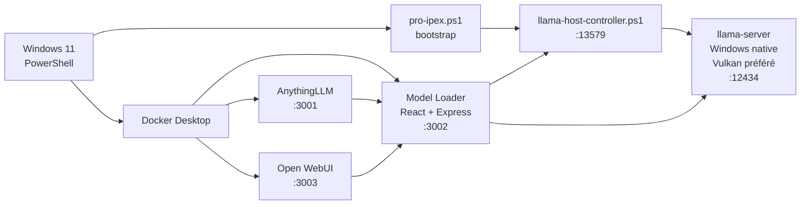

<div align="center">

<h1>LIA2</h1>

<p><strong>Local Intelligence Assistant 2 for Windows with llama.cpp</strong></p>

<p>
  Déploie une stack IA locale complète sur Windows avec <strong>llama.cpp</strong>, <strong>AnythingLLM</strong>, <strong>Open WebUI</strong> et un <strong>Model Loader</strong> dédié,<br>
  avec un runtime natif Windows piloté par PowerShell et un proxy OpenAI local prêt à l'emploi.
</p>

<p>
  
  
  
  
  
</p>

<p>
  <a href="#quick-start"></a>
  <a href="#architecture"></a>
  <a href="#included-services"></a>
</p>

</div>

<table>
  <tr>
    <td width="50%" valign="top">
      <h3>One command bootstrap</h3>
      <p>Un seul script PowerShell installe le runtime local, prépare llama.cpp, construit le Model Loader et démarre les interfaces.</p>
    </td>
    <td width="50%" valign="top">
      <h3>Windows-native runtime</h3>
      <p>L'inférence tourne nativement sur Windows via llama-server, sans dépendance WSL2 dans l'architecture active.</p>
    </td>
  </tr>
  <tr>
    <td width="50%" valign="top">
      <h3>Multiple frontends</h3>
      <p>AnythingLLM, Open WebUI et le Model Loader cohabitent sur des conteneurs séparés au-dessus d'un même runtime local.</p>
    </td>
    <td width="50%" valign="top">
      <h3>Model workflow local-first</h3>
      <p>Import GGUF Hugging Face, import depuis Ollama Library, chargement mémoire et proxy OpenAI sans dépendance cloud.</p>
    </td>
  </tr>
</table>

---

## Table of Contents

- [Overview](#overview)
- [Why LIA](#why-lia)
- [Quick Start](#quick-start)
- [Included Services](#included-services)
- [Architecture](#architecture)
- [Feature Highlights](#feature-highlights)
- [Usage Flow](#usage-flow)
- [Recommended Models](#recommended-models)
- [Project Structure](#project-structure)
- [Technical Notes](#technical-notes)
- [Useful Commands](#useful-commands)
- [Troubleshooting](#troubleshooting)
- [Positioning](#positioning)

---

## Overview

LIA est un projet d'intégration local-first conçu pour transformer une machine Windows en station IA locale cohérente, avec un accent fort sur l'installation, la reprise après redémarrage et la simplicité d'usage. La stack actuelle remplace l'ancienne architecture Ollama/IPEX/WSL2 par un runtime [llama.cpp](runtime/llama.cpp/README.md) natif Windows, exposé via un contrôleur hôte et consommé par des interfaces Docker séparées.

Le projet assemble cinq briques principales :

- un runtime [llama.cpp](runtime/llama.cpp/README.md) natif Windows, orienté Vulkan ;
- un contrôleur PowerShell hôte pour démarrer, arrêter et superviser [llama-host-controller.ps1](llama-host-controller.ps1) ;
- un Model Loader React + Express pour gérer les GGUF et exposer un proxy OpenAI compatible ;
- AnythingLLM pour le chat et les usages documentaires ;
- Open WebUI comme interface alternative branchée sur le proxy local.

---

## Why LIA

Le besoin visé est simple : obtenir une stack LLM locale propre sur Windows, sans recoller manuellement runtime GPU, scripts de lancement, configuration d'interfaces et sélection de modèles à chaque redémarrage.

LIA encapsule cette complexité dans un projet unique afin de fournir :

- un bootstrap reproductible ;
- une détection matérielle côté script ;
- un runtime local stable autour de llama.cpp ;
- une préférence claire pour Vulkan sur Windows ;
- plusieurs interfaces prêtes à l'emploi ;
- une gestion de modèles centralisée et plus simple que la ligne de commande seule.

---

## Quick Start

```powershell
git clone https://github.com/ton-user/lia.git
cd lia
.\pro-ipex.ps1
```

Le point d'entrée principal est [pro-ipex.ps1](pro-ipex.ps1). Le script prépare le runtime, télécharge les binaires officiels de llama.cpp si nécessaire, construit l'image du Model Loader puis démarre les services.

Une fois la stack active, les services suivants sont exposés :

- http://localhost:3001
- http://localhost:3002
- http://localhost:3003

Le runtime local de génération écoute sur http://127.0.0.1:12434 et le contrôleur hôte sur http://127.0.0.1:13579.

---

## Included Services

| Service | URL | Rôle |
|---|---|---|
| AnythingLLM | http://localhost:3001 | Interface principale pour le chat, la documentation et les workflows RAG |
| Model Loader | http://localhost:3002 | Gestion des modèles GGUF, contrôle du runtime et proxy OpenAI local |
| Open WebUI | http://localhost:3003 | Interface alternative connectée au proxy local |
| llama.cpp runtime | http://127.0.0.1:12434 | Runtime natif Windows basé sur llama-server |
| Host controller | http://127.0.0.1:13579 | API locale de contrôle du runtime |

Le proxy OpenAI du Model Loader expose un identifiant de modèle stable : `lia-local`.

---

## Architecture



Le flux est volontairement simple : l'inférence reste sur l'hôte Windows, tandis que les interfaces applicatives tournent dans des conteneurs séparés. Le Model Loader sert à la fois d'interface d'administration, de passerelle vers le contrôleur hôte et de proxy OpenAI compatible pour AnythingLLM et Open WebUI.

---

## Feature Highlights

| Fonctionnalité | Détail |
|---|---|
| Bootstrap en une commande | Une exécution de [pro-ipex.ps1](pro-ipex.ps1) prépare l'environnement et démarre la stack |
| Runtime natif Windows | L'inférence repose sur `llama-server.exe` au lieu d'une couche WSL2 |
| Préférence Vulkan | Le script privilégie Vulkan sur Windows et évite l'installation SYCL dans le flux actif |
| Binaires officiels llama.cpp | Téléchargement des releases officielles avant toute tentative de build local |
| Auto-config AnythingLLM | Provider OpenAI-compatible et modèle `lia-local` injectés automatiquement |
| Auto-config Open WebUI | Configuration persistée pour pointer vers le proxy du Model Loader |
| Model Loader intégré | UI dédiée pour lister, importer, charger, décharger et sélectionner les modèles |
| Import GGUF Hugging Face | Import direct depuis une URL de fichier `.gguf` |
| Import Ollama Library | Import via référence de bibliothèque ou URL `ollama.com/library` |
| Runtime partagé | AnythingLLM et Open WebUI réutilisent le même runtime sans le relancer inutilement |

---

## Usage Flow

### 1. Démarrer la stack

Exécuter [pro-ipex.ps1](pro-ipex.ps1).

### 2. Importer un modèle

Utilise le Model Loader pour :

- importer un fichier GGUF depuis Hugging Face ;
- importer depuis Ollama Library ;
- sélectionner un modèle local déjà présent ;
- charger ou décharger le modèle dans le runtime.

Exemples de références utiles dans le Model Loader :

- `https://huggingface.co/.../resolve/main/model.gguf`
- `gemma3n:e4b`
- `https://ollama.com/library/gemma3n:e4b`

### 3. Tester le proxy local

```powershell
Invoke-WebRequest -Uri "http://127.0.0.1:3002/health" -UseBasicParsing
```

### 4. Utiliser les interfaces

- AnythingLLM pour le workflow applicatif principal ;
- Model Loader pour piloter le runtime et les modèles ;
- Open WebUI pour une interface de chat alternative.

---

## Recommended Models

Pour une machine légère orientée réactivité, les modèles GGUF quantifiés suivants sont de bons candidats :

- `gemma-3n-E4B-it-Q4_K_M.gguf`
- `Qwen2.5-1.5B-Instruct-Q4_K_M.gguf`
- `Llama-3.2-1B-Instruct-Q4_K_M.gguf`
- `Phi-3.5-mini-instruct-Q4_K_M.gguf`

Le projet fonctionne mieux avec des formats GGUF adaptés à la mémoire disponible, et le script tente de réutiliser une configuration existante quand elle est déjà présente.

---

## Project Structure

```text
.
├── Dockerfile.anythingllm
├── Dockerfile.model-loader
├── evolution vers llama.cpp.MD
├── llama-host-controller.ps1
├── pro-ipex.ps1
├── README.md
├── model-manager/
│   ├── index.html
│   ├── package.json
│   ├── server-package.json
│   ├── server.js
│   ├── src/
│   │   ├── App.css
│   │   ├── App.jsx
│   │   └── main.jsx
│   └── vite.config.js
├── models/
└── runtime/
```

---

## Technical Notes

### Orchestration script

Le script [pro-ipex.ps1](pro-ipex.ps1) gère le téléchargement des binaires llama.cpp, la normalisation de la configuration runtime, le démarrage du contrôleur hôte, le build de [Dockerfile.model-loader](Dockerfile.model-loader) et le lancement des conteneurs applicatifs.

### Host controller

Le contrôleur [llama-host-controller.ps1](llama-host-controller.ps1) expose une API locale simple pour :

- lire l'état du runtime ;
- démarrer ou arrêter `llama-server.exe` ;
- réutiliser le modèle déjà chargé quand c'est pertinent ;
- éviter les redémarrages inutiles lors du changement d'interface.

### Model Loader

L'interface [model-manager/src/App.jsx](model-manager/src/App.jsx) permet :

- de lister les modèles disponibles ;
- de suivre le statut du runtime ;
- de charger et décharger les modèles ;
- d'importer depuis Hugging Face ou Ollama Library ;
- d'exposer un point d'accès OpenAI compatible pour les autres interfaces.

Le backend [model-manager/server.js](model-manager/server.js) traduit les actions du frontend vers le contrôleur hôte, le runtime llama.cpp et les routes OpenAI compatibles `/v1/models`, `/v1/chat/completions`, `/v1/completions` et `/v1/embeddings`.

### Container images

- [Dockerfile.model-loader](Dockerfile.model-loader) construit l'image active du Model Loader.
- [Dockerfile.anythingllm](Dockerfile.anythingllm) reste dans le dépôt mais n'est pas la voie principale utilisée par le script actuel, qui démarre l'image upstream `mintplexlabs/anythingllm:latest`.

---

## Useful Commands

```powershell
# Vérifier la santé du Model Loader
Invoke-WebRequest -Uri "http://127.0.0.1:3002/health" -UseBasicParsing

# Vérifier le runtime llama.cpp
Invoke-WebRequest -Uri "http://127.0.0.1:12434/health" -UseBasicParsing

# Logs du conteneur Model Loader
docker logs -f model-loader

# Logs du conteneur AnythingLLM
docker logs -f anythingllm

# Logs du conteneur Open WebUI
docker logs -f open-webui

# Relancer proprement la stack via le script principal
.\pro-ipex.ps1
```

---

## Troubleshooting

| Problème | Vérification utile |
|---|---|
| Le runtime ne répond pas | Vérifier `http://127.0.0.1:12434/health` et les logs dans `runtime/llama-server.stdout.log` |
| Le contrôleur hôte ne démarre pas | Vérifier `http://127.0.0.1:13579` et relancer [pro-ipex.ps1](pro-ipex.ps1) |
| AnythingLLM ou Open WebUI ne voient pas le modèle | Vérifier que le Model Loader expose bien `lia-local` sur `http://model-loader:3002/v1` |
| Le GPU n'est pas exploité | Vérifier que le backend actif remonté par le Model Loader est bien `vulkan` |
| L'interface n'affiche pas les derniers changements | Rebuilder l'image du Model Loader puis forcer un rafraîchissement du navigateur |

---

## Positioning

LIA n'est pas un framework généraliste. C'est un dépôt d'intégration ciblé pour obtenir une stack IA locale propre, reproductible et exploitable sur Windows, avec un runtime llama.cpp natif, un proxy OpenAI local et des interfaces prêtes à l'emploi.

Si l'objectif est de transformer une machine personnelle en station locale de chat, de test de modèles GGUF et d'expérimentation multi-interface, ce dépôt est construit exactement pour ce cas.
