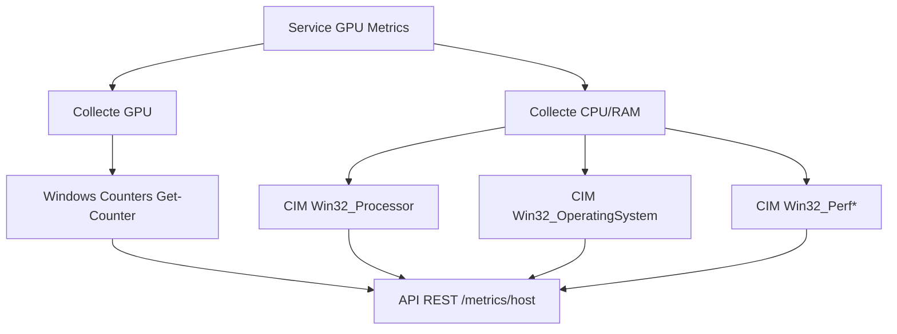

# Collecte des Métriques Système dans LIA

## Vue d'ensemble

LIA collecte des métriques système (CPU, RAM, GPU) pour surveiller les performances du système hôte et optimiser l'utilisation des ressources lors de l'exécution des modèles d'IA.

## Architecture de collecte



## Méthodes de collectage 

### 1. GPU (services\gpu-metrics\service.ps1)

La collecte repose **uniquement sur les compteurs Windows**, disponibles sur les
quatre vendors (NVIDIA, AMD, Intel, CPU-only) sans aucune dépendance externe.

#### Compteurs Windows (méthode en production)
- **Outil**: `Get-Counter` (PDH natif) + `Win32_VideoController` (CIM)
- **Chaînes**:
  - `\GPU Engine(*)\Utilization Percentage` → `LoadPercent`
  - `\GPU Process Memory(*)\Dedicated Usage` → `VramUsedBytes`
    (repli `\GPU Adapter Memory(*)\Dedicated Usage`)
- **Avantages**: toujours disponible, aucune installation, multi-vendor
- **Limites**: pas de température, pas de consommation, pas d'horloges GPU —
  ces valeurs ne sont pas exposées par PDH. `TemperatureCelsius` et
  `PowerDrawWatts` restent donc `null` dans la réponse.
- **Status**: **utilisé — c'est l'unique source**

#### Méthodes écartées
- **hw-smi** (`hw-smi (c) Dr. Moritz Lehmann`) : c'est une application Win32
  fenêtrée (elle ouvre une fenêtre et boucle sur `GetMessage`), pas un outil
  console. Elle n'expose aucun mode JSON/CSV et ne peut pas être pilotée depuis
  un service. **Abandonné, binaire retiré du dépôt.**
- **LibreHardwareMonitor** : nécessiterait LibreHardwareMonitor installé à côté
  de l'application. Non retenu pour ne pas ajouter de dépendance à
  l'installateur. `Status` : **non utilisé**.

### 2. CPU et RAM

#### Méthodes utilisées:
- **CIM Win32_Processor**: Informations CPU (modèle, cœurs, fréquences)
- **CIM Win32_OperatingSystem**: Mémoire système (total, utilisé, libre)
- **Win32_PerfFormattedData_Counters_ProcessorInformation**: Utilisation CPU par cœur
- **Win32_PerfFormattedData_Counters_Memory**: Métriques mémoire détaillées

## API du service

### Endpoint principal
```
GET http://127.0.0.1:13621/metrics/host
```

### Réponse JSON exemple
```json
{
  "source": "hardware-monitor-host",
  "gpuType": "INTEL",
  "detection": {
    "source": "hardware-profile",
    "vendor": "intel",
    "label": "Intel(R) Arc(TM) 140V GPU (16GB)"
  },
  "metrics": {
    "CPU": {
      "TotalLoadPercent": 35,
      "Cores": [
        { "CoreId": "0,0", "LoadPercent": 82, "FrequencyMHz": 2024 }
      ]
    },
    "Memory": {
      "TotalBytes": 33817078784,
      "UsedBytes": 15435014144,
      "FreeBytes": 18382064640,
      "UsedPercent": 45.7
    },
    "GPUs": [
      {
        "Name": "Intel(R) Arc(TM) 140V GPU (16GB)",
        "Vendor": "INTEL",
        "LoadPercent": 37.4,
        "AdapterRAMBytes": 2147479552,
        "VramUsedBytes": 1073741824,
        "TemperatureCelsius": null,
        "PowerDrawWatts": null,
        "DriverVersion": "32.0.101.8629",
        "Source": "WindowsCounters"
      }
    ]
  },
  "timestamp": "2026-04-28T22:01:52.0000000+02:00"
}
```

> `LoadPercent` est borné à 100 (maximum par instance `\GPU Engine(*)`).
> `AdapterRAMBytes` reflects la valeur rapportée par WMI, souvent plafonnée ou
> trompeuse sur les GPU avec mémoire unifiée (iGPU) : ne pas l'utiliser comme
> source de vérité de la VRAM. `TemperatureCelsius` et `PowerDrawWatts` restent
> `null` — voir « Limites » plus haut.

## Configuration et déploiement

### Service Windows
- **Nom**: "LIA GPU Metrics"
- **Exécutable**: `services\gpu-metrics\service.ps1` (via `install-service.ps1`)
- **Port**: 13621 (`config.json` → `ports.gpuMetrics`)
- **Installation**: Via NSSM (Non-Sucking Service Manager) — `installer\nssm\win64\nssm.exe`
- **Profil hardware**: lu depuis `runtime\hardware-profile.json` pour
  `gpuType` / `detection` (optionnel : le service répond même s'il est absent)

### Ordre de démarrage
1. **LIA Controller** (port 13579) - Contrôleur principal
2. **LIA GPU Metrics** (port 13621) - Métriques système
3. **llama-server** (port 12434) - Runtime IA
4. **Model Loader** (port 3005) - Interface de gestion

## Outils de diagnostic

### Vérification du service
```powershell
Get-Service "LIA GPU Metrics"
Get-NetTCPConnection -LocalPort 13621 -State Listen
Invoke-WebRequest http://127.0.0.1:13621/metrics/host
```

### Logs du service
- NSSM logs: `nssm.exe dump "LIA GPU Metrics"`
- Processus: `Get-Process pwsh | Where-Object {$_.CommandLine -match 'gpu-metrics-service'}`

### Test manuel
```powershell
# Test des compteurs Windows (seule source en production)
Get-Counter '\GPU Engine(*)\Utilization Percentage'
Get-Counter '\GPU Process Memory(*)\Dedicated Usage'
Get-CimInstance Win32_VideoController | Select-Object Name, AdapterRAM, DriverVersion
```

## Optimisations futures

1. **Température et consommation GPU** : non exposées par PDH. Necessiterait un
   acces direct au pilote (NVML sur NVIDIA, ADLX sur AMD) via une bibliotheque
   P/Invoke depuis PowerShell — pas de dependance externe a installer, mais du
   code specifique par vendor a ecrire et maintenir.
2. **Cache des métriques**: Réduire la fréquence d'interrogation pour les métriques lentes
3. **Alertes**: Notifications quand seuils de performance dépassés
4. **Historique**: Stockage des métriques pour analyse temporelle</content>
<parameter name="filePath">C:\Users\evolu\Documents\Github-repo\LIA-X\docs\metrics-collection.md